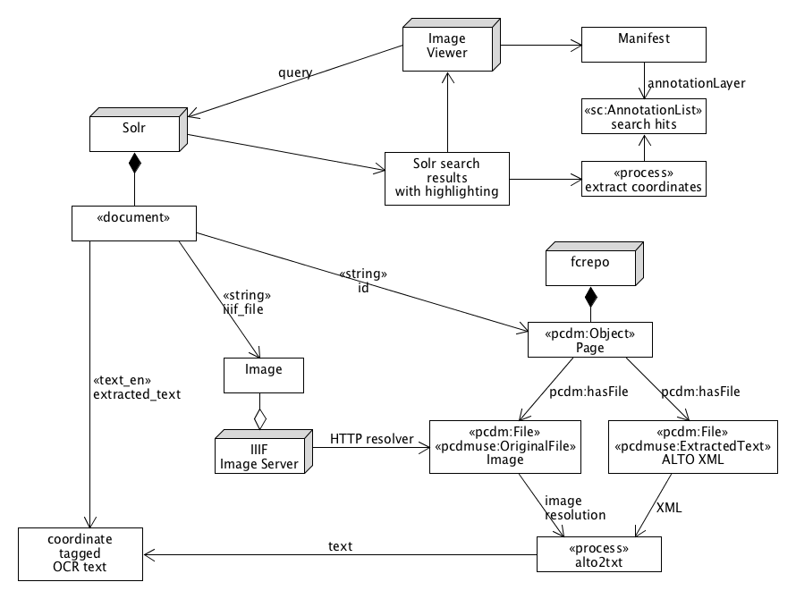

title: UMD Libraries IIIF/Fedora 4 Integration
author:
  name: Peter Eichman
  email: peichman@umd.edu
  url: https://github.com/peichman-umd
theme: theme
output: index.html

--

# IIIF/Fedora 4 Integration

## 

--

### Goals

- Repository-centric implementation
- Store masters in Fedora
- Treat IIIF as another index of Fedora data

--

### Technology Choices

- Use Loris as our IIIF Server
- Use HTTP resolver to connect Loris and Fedora

--

### Major Project

- Diamondback Newspaper Digitization
- OCR search and text highlighting

--

### Challenges

- Full text search that is able to map to or preserve coordinate info for highlighting

--

### Solutions considered

- Pure text matching
- Position-based matching
- Text matching with context
- Embedded coordinates
- Content Search API

--

### Pure text matching

If a word is highlighted in the solr result, then search for all occurrences of that word in the ALTO document and return that list of coordinates. This is an easy approach, but has the potential to match too much if the query doesn't match all occurrences of a given word.

--

### Position-based matching

Attempt to match highlighted words to those in the original ALTO document based on their position in the document. This would require careful synchronization of the full-text field and the ALTO file to ensure that the word positions matched.

--

### Text matching with context

Attempt to match the highlighted word by using exact match, but then verify that at least the preceding and following words match.

--

### Embedded coordinates

Include the ALTO coordinates for each word in the text to be indexed by Solr. The challenge is to include the coordinates in such a way that will not interfere with Solr's processing of the field.

--

### Content Search API

Preprocess the ALTO XML file into sets of annotation lists for words, lines, blocks, and pages. Use an off-the-shelf implementation of the Content Search API, or implement our own, to search this set of predefined annotations.

--

### Solution chosen

- Embedded coordinates

--

### Embedded coordinates: Indexing

- As part of ingest, extract text and coordinates from the ALTO XML
- Store the text with the coordinates embedded in it in an `extracted_text` field in Solr, in the form `word{x,y,w,h}`
- Solr text matching still works; tokenizer strips the `{...}` before analysis.

--

### Embedded coodinates: Searching

- When searching Solr, request highlighting for the `extracted_text` field
- Post-process the Solr results to extract the highlighted words and their associated coordinates. Use this info to construct a dynamic annotation list.

--

### Process

--

### Code

- <https://github.com/peichman-umd/iiif-tools-prototype>
  - [alto2txt.xsl](https://github.com/peichman-umd/iiif-tools-prototype/blob/master/alto2txt.xsl)
  - [extracthits.rb](https://github.com/peichman-umd/iiif-tools-prototype/blob/master/extracthits.rb)

--

### Status

- Have been developing proofs-of-concept of portions of the chosen solution.
- Working on a batch loader to ingest newspaper data so we can do further development with real assets.

--

### Our TODO List

- Permissions propagation from Fedora to Loris
- Presentation API: manifests and annotations

--

### Links

- IIIF Image API: <http://iiif.io/api/image/2.1/>
- Loris: <https://github.com/loris-imageserver/loris>
- IIIF Presentation API: <http://iiif.io/api/presentation/2.1/>
